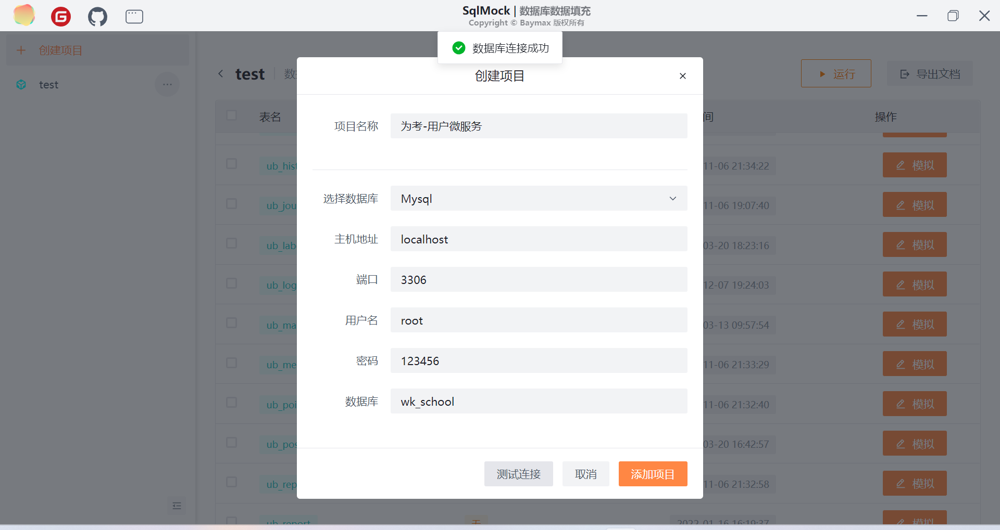
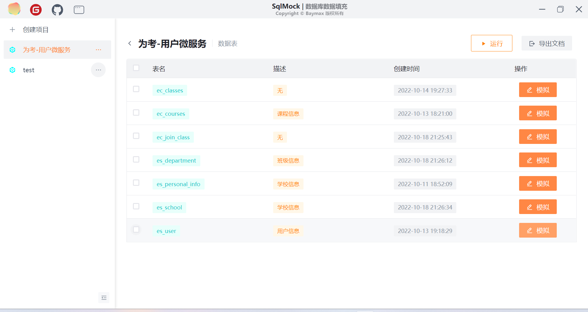
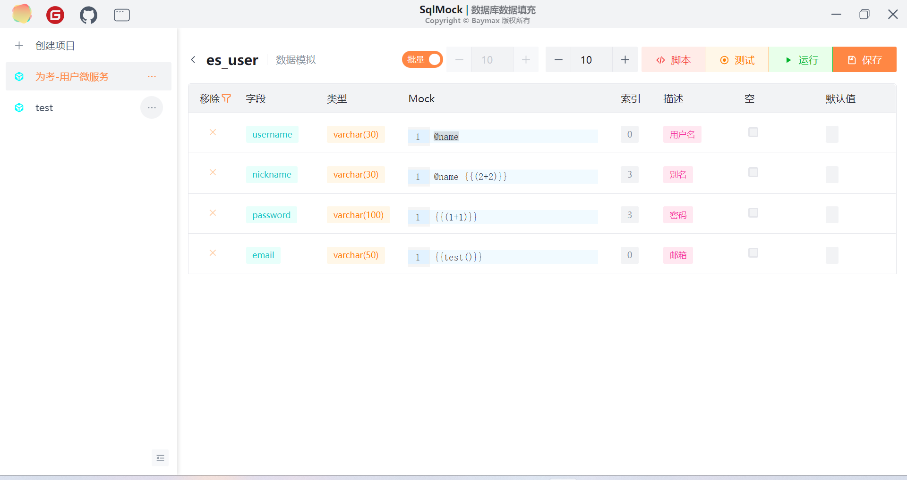
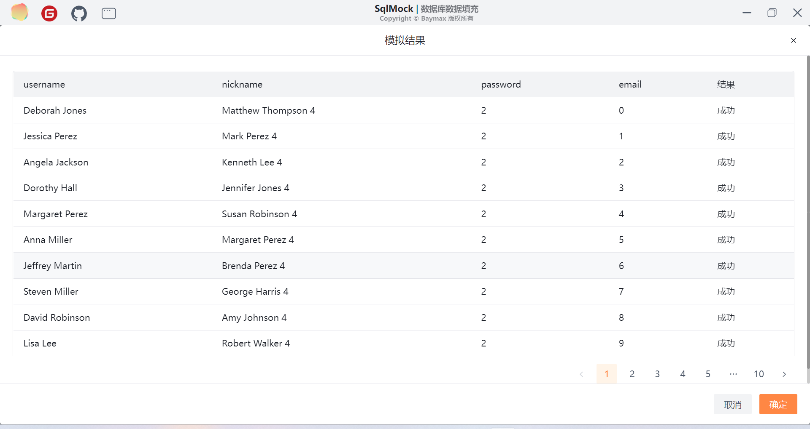
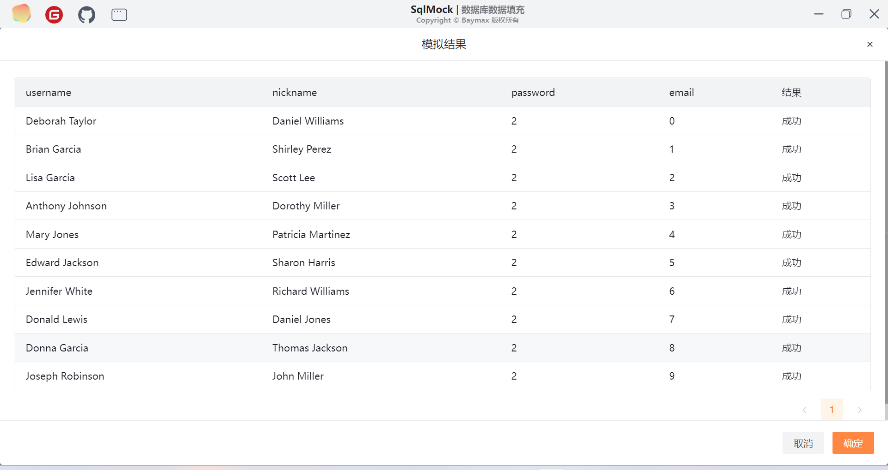
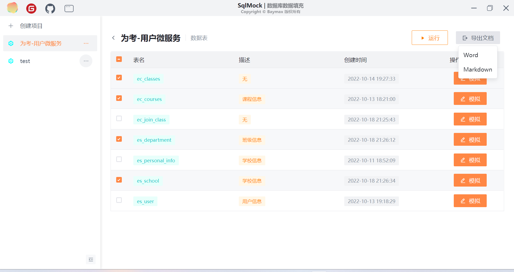
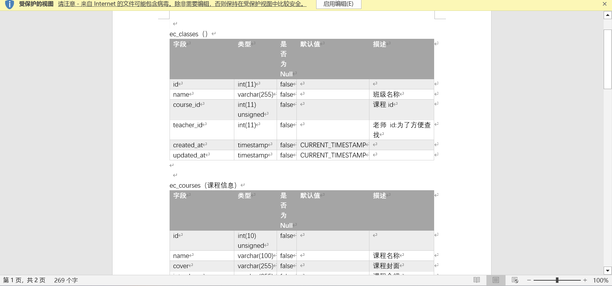
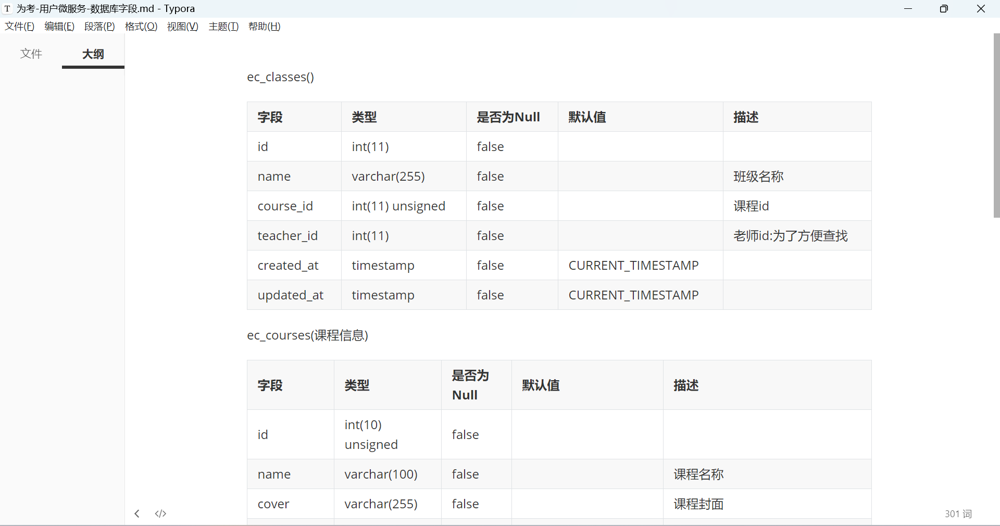

# SqlMock 数据库数据填充


> 编写该工具的原因，是因为毕设的项目，数据太少，需要数据填充，顺便也生成下毕设逻辑设计中表的结构
>
> 其他工具，要么就是要写代码，要么就是数据太死板，于是就想结合下 Mock.js 生成数据.

如果你觉得该工具好用的话~欢迎给个 star。
[Baymax Gitee](https://gitee.com/baymaxsjj/sqlmock)
[Baymax Github](https://github.com/baymaxsjj/sqlmock)

> 代码写的烂，采用 CV 大法，百度拼凑而成，水平有限~~~
>
> 版权说明：未经本人允许禁止用于任何商业用途。仅限个人学习使用
### 下载
> 注意此下载方式，不一定是最新版本，可能存在些bug。如需使用最新版本，可以克隆本项目后自行打包。
[Gitee releases](https://gitee.com/baymaxsjj/sqlmock/releases)
[Github releases](https://github.com/baymaxsjj/sqlmock/releases)

### 系统

- 框架：Vue、Vite、Mock、Electron

- 数据库插件：Mysql2、Sequelize 框架

- 文档模板：docxtemplater

- 等等第三方插件

### 功能

- [x]  数据库适配器
- [x] 创建项目、连接数据库等
- [x] 数据填充，支持批量、单次插入（防止批量插入异常，导致插入失败、）
- [x] 自定义表字段填充数据
- [x] 支持测试数据
- [x] 表结构导出，支持 Word、Markdown 格式
- [x] 支持一键简单生成mock.js占位符

### 测试

Mysql 5.Xx

### 使用

支持 Mock.js 语法、支持 Js 脚本（通过`{{表达式/函数调用}}`）、支持部分字段填充、支持表文档导出

##### 创建项目、连接数据库



##### 选择数据表



##### 编写脚本（可选），`mockCount`运行次数、`Mock`mock.js


##### 编写表达式 @mock、{{表达式}}、{{Mock.xxx}}

注意@mock 和{{}}一起使用时之间加个空格，要不然@mock 无法使用



##### 测试数据是否正常



##### 运行

如果批量插入有问题，请关闭批量
单次插入次数过多有连接问题



### 表结构文档导出

选择需要导出的表



##### Word



##### Markdown



### Instal

```bash
$ pnpm install
```

### Development

```bash
$ pnpm run dev
```

### Build

```bash
# For windows
$ pnpm run build:win

# For macOS
$ pnpm run build:mac

# For Linux
$ pnpm run build:linux
```
